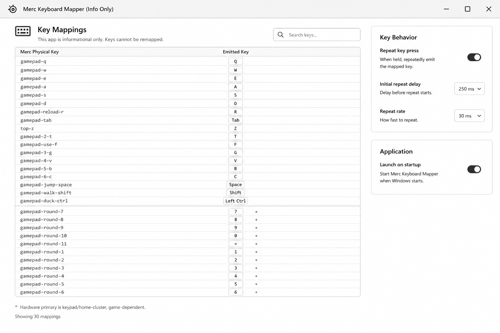

# GUI And Startup Provisioning

## Purpose

This document tracks the implemented GUI/startup surface alongside the Merc console mapper.

The initial wireframe is now part of the repo:



Use this as the baseline layout unless the user provides a newer design. Do not invent additional UI, styling, or layout beyond the wireframe.

## Wireframe Requirements

- App title: `Merc Keyboard Mapper (Info Only)`
- Main content: key mapping table with `Merc Physical Key` and `Emitted Key` columns
- Mapping table is informational; keys cannot be remapped in the first GUI version
- Search box filters visible keys
- Round-number rows show a `*` caveat marker
- Caveat text: `Hardware primary is keypad/home-cluster, game-dependent.`
- `gamepad-round-11` uses the variant caveat `Hardware primary is keypad add, game-dependent.`
- Footer shows mapping count
- Right panel contains `Key Behavior`
- Key behavior includes Q toggle, repeat toggle, initial repeat delay selector, and repeat rate selector
- Right panel contains `Application`
- Application section includes `Launch on startup` toggle
- Preserve the simple Windows desktop app feel from the wireframe unless superseded

## Implemented Projects

- `apps/merc-mapper/src/Merc.Mapper.Core/Merc.Mapper.Core.csproj` contains shared mapper runtime, startup registration, key catalog, and Windows interop.
- `apps/merc-mapper/src/Merc.Mapper/Merc.Mapper.csproj` is the console runner.
- `apps/merc-mapper/native/MercShellHook/MercKeyboardMapper.cpp` is the native Win32 GUI/tray wrapper.

Published manual-test binaries live in:

```text
C:\Users\pat_q\Desktop\merc-mapper-run
```

Run the GUI:

```powershell
& "C:\Users\pat_q\Desktop\merc-mapper-run\MercKeyboardMapper.exe"
```

Install the packaged GUI as a normal Windows app:

```powershell
& "C:\Users\pat_q\Desktop\merc-mapper-run\MercKeyboardMapperSetup.exe"
```

The setup wizard copies the package to `%ProgramFiles%\Merc Keyboard Mapper`, creates Start Menu shortcuts, and registers a Settings > Apps uninstall entry. Windows will ask for administrator permission. The uninstaller removes the GUI and console startup Run values so Windows does not try to start a removed app.

Build the local runner from a Windows filesystem checkout or staged copy:

```cmd
apps\merc-mapper\package-release.cmd
```

## Startup Model

Use per-user startup registration:

```text
HKCU\Software\Microsoft\Windows\CurrentVersion\Run
```

This keeps installation admin-free and lets the GUI expose a simple startup toggle.

The console and GUI use separate Run values so the GUI checkbox does not overwrite a console startup registration:

```text
MercMapper
MercMapperGui
```

Development console commands:

```powershell
.\Merc.Mapper.exe --install-startup
.\Merc.Mapper.exe --uninstall-startup
```

Console startup installs the current console executable path in development builds. If `--no-q`, `--keypad-cluster`, `--repeat`, `--repeat-delay-ms`, or `--repeat-rate-ms` are passed during install, those options are preserved in the console startup command. Production packaging does not expose the console executable.

GUI startup installs the current native wrapper executable path with `--startup` and preserves the GUI Q and repeat settings. The keypad/home-cluster mapping remains hidden from the production GUI because its global hook path is game-dependent and can affect normal numpad/home-cluster keys.

## GUI Responsibilities

- start the hidden `MercKeyboardMapperEngine.exe` mapper engine automatically while the GUI process is active
- keep the mapper active when the window is closed or minimized to the system tray
- reload the mapper when key behavior settings change
- show running/stopped status
- show recent logs
- toggle startup registration
- toggle Q mapping
- toggle repeat mode
- exit explicitly from the tray menu and release mapped keys

## Implementation Boundary

Keep input mapping behavior separate from UI decisions.

The console mapper must remain runnable after GUI work. The GUI launches the console mapper and passes the same documented flags rather than forking mapping rules.

The native GUI avoids the .NET Desktop Runtime dependency. The packaged app still requires the normal .NET 8 Runtime x64 because `MercKeyboardMapperEngine.exe` remains a framework-dependent .NET mapper engine. The source console app remains available for development, but production packaging uses a GUI-subsystem engine so users do not get a console window.
